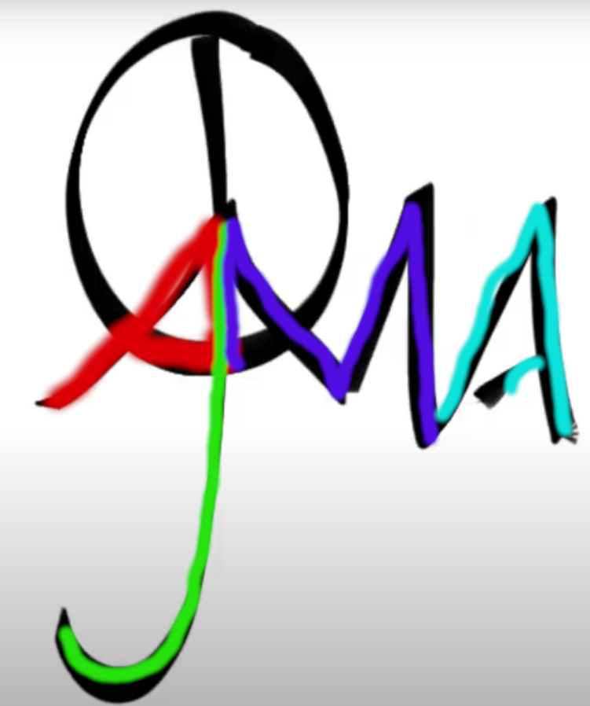
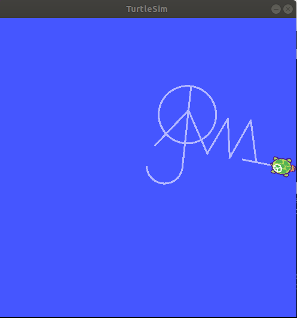
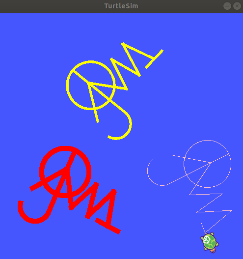
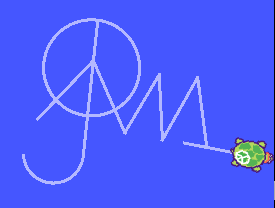
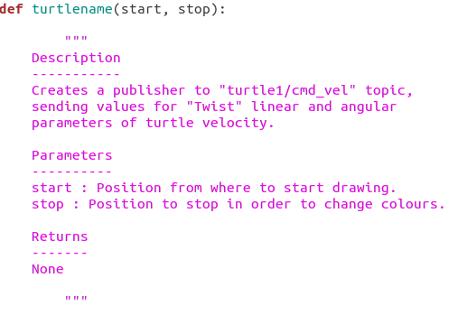
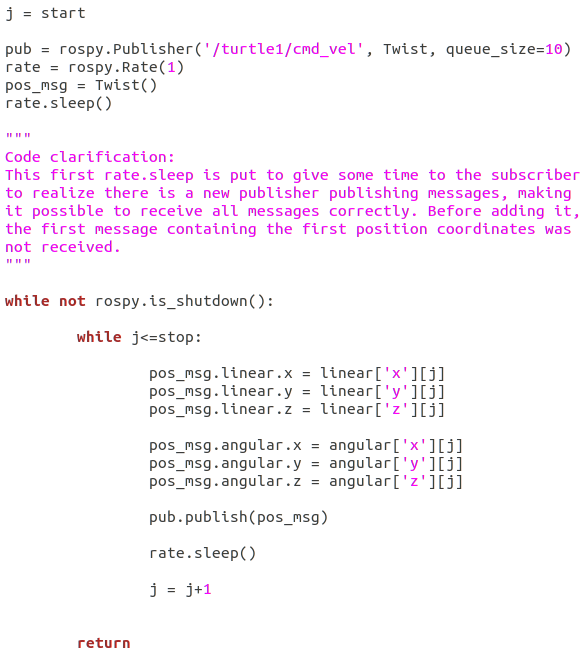
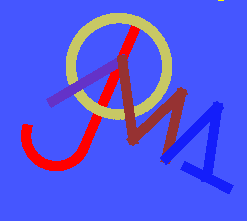

# ROS Assignments
Assignments for Mobile Robotics subject in UVic-UCC under ROS environment.
There are two exercises (exercise 3 and exercise 4) which are linked.
Both of them are divided into two parts:
  - Part A: Task shall be developed in .sh
  - Part B: Task shall be developed in .py

The task is to use turtlesim node in order to draw three consecutive letters of your name/surname. It could also be something that represents you.  
For exercise 3, the drawing shall be done using solely ROS topics.  
As for exercise 4, ROS services shall be included to draw the letters separately and in different colours.

### Letters
In my case, I went with my brand, which I believe represents me.  
  
My initials are A.J.M.A. which are hidden in the brand as the next figure shows.  
  

## Where to find the files
To begin with, beginnerTutorials and CMakeLists shall be ignored. They were pushed by mistake, since they share the same local repository with the exercises' folder.  
Both exercise_3 and exercise_4 folders are the ROS packages. Inside each, you will find a folder called scripts that contains both files .sh (for part A) and .py (for part B).  

Ex. 3 part A: ROSassignmnents/exercise_3/scripts/turtlename.sh  

Ex. 3 part B: ROSassignmnents/exercise_3/scripts/turtlename.py  

Ex. 4 part A: ROSassignmnents/exercise_4/scripts/turtlesplitname.sh  

Ex. 4 part B: ROSassignmnents/exercise_4/scripts/turtlesplitname.py  

## Clarifications
- In order to create my brand using Turtlesim node, there is a moment where the turtle does the circle twice. The reason for this is that the position the turtle ends at after the second round, is ideal to begin the stroke of the first initial.
- As agreed previously with the professor, for my case, in exercise 4 instead of separating each initial from the brand, I will make different copies of it with different location and colour[^1].
- The positions of the brand on exercise 4 are random so to make it more "graffiti like", which seemed cooler to me. The positions for part A and part B on exercise 4 are different.

## Results 
Results for exercise 3 (left) and exercise 4 (right)[^2]:   
   

Comparison to real-life brand:  
   

After realization [^1]:  
  
  
Function "turtlename" has two new arguments: start, stop. It is possible to access the code under "polish" branch.  
 

## References
To accomplish exercise 3, I was greatly inspired by:  
https://www.programcreek.com/python/example/88502/geometry_msgs.msg.Vector3

http://docs.ros.org/en/api/geometry_msgs/html/msg/Twist.html

http://wiki.ros.org/turtlesim/Tutorials/Moving%20in%20a%20Straight%20Line

And for exercise 4:  
http://wiki.ros.org/executive_teer/Tutorials/On%20Termination

https://answers.ros.org/question/12793/rospy-calling-clear-service-programatically/

http://wiki.ros.org/rospy/Overview/Services

http://wiki.ros.org/ROS/Tutorials/WritingServiceClient%28python%29

http://docs.ros.org/en/api/turtlesim/html/srv/SetPen.html

http://wiki.ros.org/turtlesim

https://gist.github.com/bayodesegun/d71eda74018e9d208ebc2f1c478346e4

## Idea  
Since we all have different names, by doing this assignment we were unconsciously drawing the entire alphabet (or most of it). Therefore only withing our class there are the velocity coordinates of turtlesim to make most of the letters.  
Maybe it would be possible to create a class name Letter with the linear and angular velocities arrays as the attributes.  
Then we would build the database or enter all our letters this way and for the function that creates the topic, instead of looping through the array we made for our initials, we give the object of type Letter as a parameter.  

i.e.  

class Letter (x_lin, y_lin, ..., z_ang)  
  self.x_l = x_lin  
  ...  
  self.z_a = z_ang  
 
'# the attributes would be arrays, I know it would not be written this way but I know it is possible  

G = Letter([0.5, ...], [1.0, ...], ..., [0.0, ...])  

'# when calling the function that will draw  

turtlename(G)

[^1]: *31/12/21: I realized that this agreement made the exercise simpler or easier for me than for my colleagues, since I simply have to send the whole array without worrying to make it stop and how to make it stop in between each letter. I fixed the code in order to make it stop after each letter and change the colour. This way, the code could be easily reused and fits the exercise better. The new code is under the branch "polish". I attach a picture and code difference under Results.*
[^2]: *Notice how the turtle generated has also got the peace symbol ;)*
