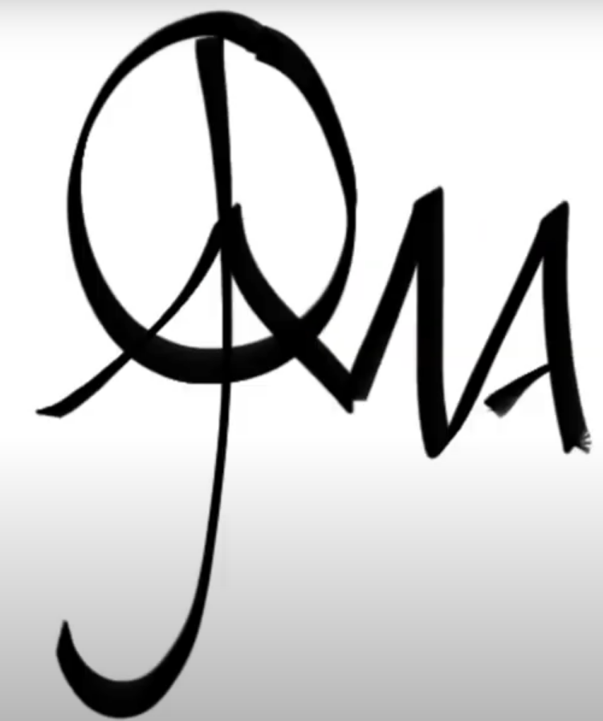

# ROS Assignments
Assignments for Mobile Robotics subject in UVic-UCC under ROS environment.
There are two exercises (exercise 3 and exercise 4) which are linked.
Both of them are divided into two parts:
  - Part A: Task shall be developed in .sh
  - Part B: Task shall be developed in .py

The task is to use turtlesim node in order to draw three consecutive letters of your name/surname. It could also be something that represents you.  
For exercise 3, the drawing shall be done using solely ROS topics.  
As for exercise 4, ROS services shall be included to draw the letters separately and in different colours.

### Letters
In my case, I went with my brand, which I believe represents me.  
  
My initials are A.J.M.A. which are hidden in the brand as the next figure shows.  
/assets/image/LogoVideo_CoolerClarified.png

## Where to find the files
To begin with, beginnerTutorials and CMakeLists shall be ignored. They were pushed by error as they share the same local repository with exercises folders.
Both exercise_3 and exercise_4 folders are the ROS packages. Inside each you will find a folder called scripts that contains both files .sh (for part A of exercises) and .py (for part B of exercises).  

Ex. 3 part A: exercise_3 > scripts > turtlename.sh  

Ex. 3 part B: exercise_3 > scripts > turtlename.py  

Ex. 4 part A: exercise_4 > scripts > turtlesplitname.sh  

Ex. 4 part B: exercise_4 > scripts > turtlesplitname.py  

## Clarifications
- In order to create my brand using Turtlesim node, there is a moment where the turtle does the circle twice. The reason for this is that the position the turtle ends at after the second round, is ideal to begin the stroke of the first initial.
- The positions of the brand on exercise 4 are random to give it a bit of "urban" touch. The positions for part A and part B are different.

## Results Turtlesim 
Results for exercise 3:  
*add image of turtlesim node*

Results for exercise 4:  
*add image of turtlesim node*

Comparison to real-life brand:  
*add image of close-up brand on turtlesim node and real-life brand*

*Note that turtle generated also has peace symbol ;)*

## References
To accomplish exercise 3, I was greatly inspired by:  
https://www.programcreek.com/python/example/88502/geometry_msgs.msg.Vector3

http://docs.ros.org/en/api/geometry_msgs/html/msg/Twist.html

http://wiki.ros.org/turtlesim/Tutorials/Moving%20in%20a%20Straight%20Line

And for exercise 4:  
http://wiki.ros.org/executive_teer/Tutorials/On%20Termination

https://answers.ros.org/question/12793/rospy-calling-clear-service-programatically/

http://wiki.ros.org/rospy/Overview/Services

http://wiki.ros.org/ROS/Tutorials/WritingServiceClient%28python%29

http://docs.ros.org/en/api/turtlesim/html/srv/SetPen.html

http://wiki.ros.org/turtlesim

https://gist.github.com/bayodesegun/d71eda74018e9d208ebc2f1c478346e4
